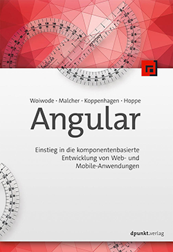

# Book-Monkey 2
[](https://travis-ci.org/angular-buch/book-monkey2)

[](http://book-monkey2.angular-buch.com/)

Der __"Book-Monkey"__ ist das Demo-Projekt zum Buch ["Angular: Einstieg in die komponentenbasierte Entwicklung von Web- und Mobile-Anwendungen"](https://angular-buch.com/). Mithilfe dieses Buchs werden Sie Googles neuestes Framework kennenlernen. Wir laden Sie dazu ein, mit den aktuellsten Technologien moderne Single-Page-Anwendungen zu erstellen.

Anhand des Beispielprojekts __"Book-Monkey"__ führen wir Sie schrittweise an die Entwicklung von Angular-Anwendungen heran. Sie werden in die grundlegenden Konzepte eingeführt, die es Ihnen ermöglichen, strukturierte, modularisierte und somit wartbare Applikationen zu erstellen.

# Das Buch

Lesen Sie mehr auf [angular-buch.com](https://angular-buch.com/).

[](https://angular-buch.com/)


# Vollständige Demo

Der BookMonkey wird im Buch in mehreren Iterationen weiter entwickelt.  
Eine Übersicht aller Funktionen ist auf [book-monkey2.angular-buch.com](http://book-monkey2.angular-buch.com/) erreichbar.

## Einzelne Beispiele

Neben der vollständigen Demo können Sie die einzelnen Entwicklungsschritte durch mehre Github-Repositories nachvollziehen.
Achten Sie auf den Download-Link im Footer der Demo unter [book-monkey2.angular-buch.com](http://book-monkey2.angular-buch.com/).


## Anzeige der Änderungen zwischen den einzelnen Schritten

** Achtung: aktuell nur unter Linux/ Unix Systemen verfügbar **
Innerhalb jeder Iteration existieren einer oder mehrere Schritte, die jeweils den vorherigen Stand des BookMonkeys erweitern bzw. verändern.
Um eine Auflistung aller Unterscheide zwischen den einzelnen Entwicklungsschritten zu erhalten, kann  der folgende Befehl auf der Konsole aufgerufen werden:

```bash
npm run diff
```

Der Befehl führt das Skript `step-diff.sh` aus und erstellt einen neuen Ordner `diffs`.
Dort liegen (sortiert nach Schritten) HTML-Dateien, die jeweils die Änderungen zwischen den BookMonkey-Versionen auflisten.
Weiterhin wird eine Index-Datei mit verweisen auf die diffs erzeugt und ein Webserver zur Auslieferung (http-server) gestartet, sofern dieser auf dem System installiert ist.

## Start

Die gezeigten Kommandozeilen-Befehle setzen voraus, dass [Node.js](https://nodejs.org/) und [Git](https://git-scm.com/) installiert sind. 

```
git clone https://github.com/angular-buch/book-monkey2.git
cd book-monkey2
npm install
npm start
```

# License
Code released under the [MIT license](https://opensource.org/licenses/MIT).
