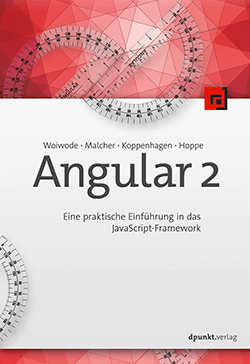

# Book-Monkey 2


Der __"Book-Monkey"__ ist das Demo Projekt zum Buch ["Angular 2: Einstieg in die komponentenbasierte Entwicklung von Web- und Mobile-Anwendungen"](https://angular2buch.de/). Mithilfe dieses Buches werden Sie Googles neuestes Framework kennen lernen. Wir laden Sie dazu ein, mit den aktuellsten Technologien moderne Single-Page-Anwendungen zu erstellen.

Anhand des Beispielprojekts __"Book-Monkey"__ führen wir Sie schrittweise an die Entwicklung von Angular2-Anwendungen heran. Sie werden in die grundlegenden Konzepte eingeführt, die es Ihnen ermöglichen, strukturierte, modularisierte und somit wartbare Applikationen zu erstellen.

# Das Buch

Lesen Sie mehr auf [angular2buch.de](https://angular2buch.de/).

[](https://angular2buch.de/)

## Beispiele

```
/iteration-1
| - /book-details
| - /book-list-simple
| - /book-list
/iteration-2
| - /dependency-injection
| - /navigation
/iteration-3
| - /forms
| - /validation
```

## Start

Die gezeigten Kommandozeilen-Befehle setzen voraus, dass [Node.js](https://nodejs.org/) und [Git](https://git-scm.com/) installiert sind. 

```
git clone https://github.com/Angular2Buch/book-monkey2.git
cd book-monkey2-api
npm install
npm start
```

# License
Code released under the [MIT license](https://opensource.org/licenses/MIT).